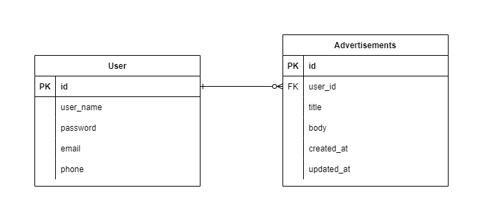

# priverion-challenge

This repository implements an API to get advertisement information.

## Install

Make sure you are using Docker

```
docker-compose -f deployments/docker-compose.yml --project-directory . up
```

## Routes

### PUBLIC
```
POST http://localhost:8080/register/
POST http://localhost:8080/login/
```

### USER (JWT Auth)
Authorization required
```
GET    http://localhost:8080/user/650aa6e112fb865df9149479
PATCH  http://localhost:8080/user/650aa6e112fb865df9149479
DELETE http://localhost:8080/user/650aa6e112fb865df9149479

GET    http://localhost:8080/advertisement/
POST   http://localhost:8080/advertisement/
GET    http://localhost:8080/advertisement/650aa6e112fb865df9149479
PATCH  http://localhost:8080/advertisement/650aa6e112fb865df9149479
DELETE http://localhost:8080/advertisement/650aa6e112fb865df9149479
```

### Diagram
